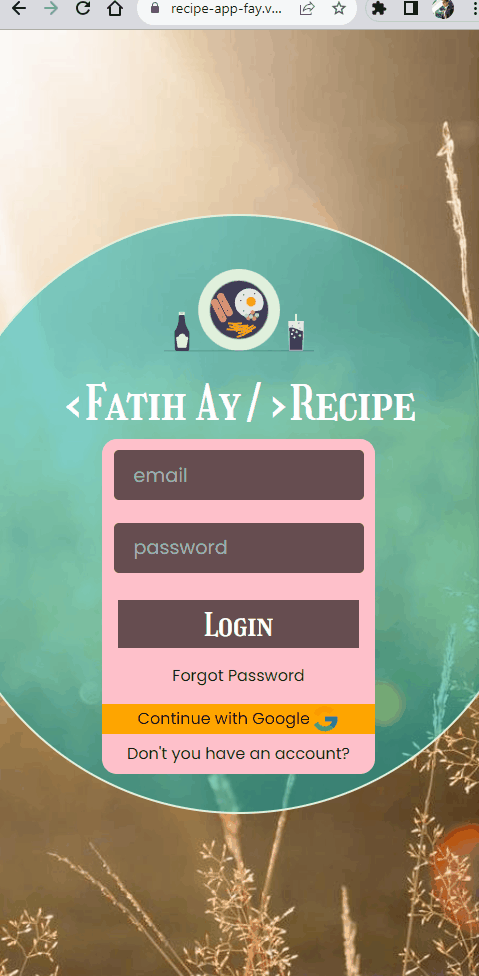

# Recipe App

## Live Link: https://recipe-app-fay.vercel.app/

## Description

This is a simple recipe application that allows users to search and explore various food recipes. Users can view recipes on the home page and access detailed information by clicking on them. The application supports user registration and login using Firebase authentication. The app features a customizable navbar and an appealing design.

## Features

- <span style="font-size: larger;">**User Authentication (Login) and Registration (Register)**</span>: Utilizes Firebase for user authentication and authorization. Allows users to register and login to the application.
- <span style="font-size: larger;">**Recipe Listing**</span>: Displays a list of various recipes with images, titles, and brief descriptions on the home page.
- <span style="font-size: larger;">**Recipe Details**</span>: Provides detailed information about each recipe, including ingredients, preparation steps, and cooking time.
- <span style="font-size: larger;">**Search Functionality**</span>: Enables users to search for specific recipes based on keywords, ingredients, or categories.
- <span style="font-size: larger;">**Firebase Integration**</span>: Utilizes Firebase for user authentication and data storage, ensuring a scalable and reliable backend infrastructure.
- <span style="font-size: larger;">**Responsive Design**</span>: Enjoy a smooth and intuitive user experience on various devices, including desktops, tablets, and mobile phones.

## Project Skeleton

```
.
├── README.md
├── package-lock.json
├── package.json
├── public
│   ├── index.html
│   └── robots.txt
├── src
│   ├── App.js
│   ├── assets
│   │   └── [your files...]
│   ├── auth
│   │   └── firebase.js
│   ├── components
│   │   ├── footer
│   │   │   ├── Footer.css
│   │   │   └── Footer.jsx
│   │   ├── header
│   │   │   ├── Header.jsx
│   │   │   └── HeaderStyles.jsx
│   │   └── navbar
│   │       ├── Navbar.jsx
│   │       └── NavbarStyles.jsx
│   ├── context
│   │   └── AuthContext.js
│   ├── helpers
│   │   └── ToastNotify.js
│   ├── index.css
│   ├── index.js
│   ├── pages
│   │   ├── about
│   │   │   ├── About.jsx
│   │   │   └── AboutStyles.jsx
│   │   ├── details
│   │   │   ├── Details.jsx
│   │   │   └── DetailsStyles.jsx
│   │   ├── home
│   │   │   ├── Home.jsx
│   │   │   ├── HomeStyles.jsx
│   │   │   └── RecipeCard.jsx
│   │   ├── login
│   │   │   ├── Login.jsx
│   │   │   └── LoginStyles.jsx
│   │   └── register
│   │       └── register.jsx
│   └── router
│       ├── AppRouter.jsx
│       └── PrivateRouter.jsx
└── tailwind.config.js
```

## Expected Outcomes

<div >


</div>

## Technologies and Libraries

- <span style="font-size: larger;">**React.js**</span>: A powerful JavaScript library for building interactive user interfaces.
- <span style="font-size: larger;">**Firebase**</span>: A cloud-based platform provided by Google that offers various services, including authentication, real-time database, and hosting.
- <span style="font-size: larger;">**React Router**</span>: A library that enables navigation and routing in a React application.
- <span style="font-size: larger;">**Tailwind CSS**</span>: A highly customizable CSS framework for creating stunning designs with minimal effort.
- <span style="font-size: larger;">**Context API**</span>: A built-in feature in React used for state management and global data sharing.
- <span style="font-size: larger;">**Styled-components**</span>: A library for styling React components using tagged template literals.
- <span style="font-size: larger;">**React-toastify**</span>: A library for displaying toast notifications in React applications.
- <span style="font-size: larger;">**Axios**</span>: A popular JavaScript library used for making HTTP requests from the browser.

## Getting Started

To run the application on your local machine, follow these steps:

1. Clone the project to your computer:

   ```
   git clone https://github.com/iamfatihay/Recipe-App.git
   ```

2. Open your terminal and navigate to the project directory.
   ```
   cd Recipe-App
   ```
3. Install the dependencies:
   ```
   npm install
   ```
4. Firebase Configuration:

- In the project directory, create a new file named firebase.js inside the src/auth folder.
- Open the src/auth/firebase.js file and add the following Firebase configuration:
  ```
  import firebase from 'firebase/app';
  import 'firebase/auth';
  // Add other Firebase services if you're going to use them

  const firebaseConfig = {
      apiKey: "YOUR_API_KEY",
      authDomain: "YOUR_AUTH_DOMAIN",
      projectId: "YOUR_PROJECT_ID",
      storageBucket: "YOUR_STORAGE_BUCKET",
      messagingSenderId: "YOUR_MESSAGING_SENDER_ID",
      appId: "YOUR_APP_ID"
   };

   // Initialize Firebase
   firebase.initializeApp(firebaseConfig);

   // Other Firebase configurations
   const auth = firebase.auth();
   // Add other Firebase services initialization here if needed

   export default auth;
  
- Replace YOUR_API_KEY, YOUR_AUTH_DOMAIN, YOUR_PROJECT_ID, YOUR_STORAGE_BUCKET, YOUR_MESSAGING_SENDER_ID, and YOUR_APP_ID with your actual Firebase project credentials.
- Now you have configured Firebase for the project. You can use this configuration to implement features like user authentication, data storage, and more.

5. Start the application:
   ```
   npm start
   ```

6. Open your web browser and visit **http://localhost:3000** to explore the Recipe Application.


## Contribution
Contributions to the project are welcome! If you find any bugs or want to add new features, please create an issue or submit a pull request.

## License
This project is licensed under the MIT License. See the LICENSE file for more information.
